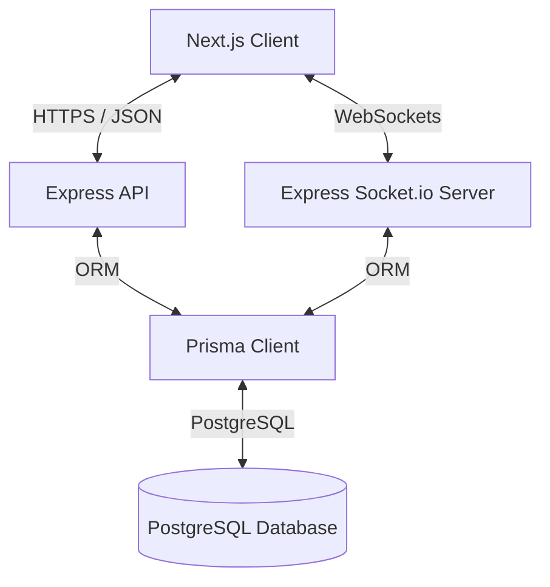

# System Architecture

WorldConnect is built with a decoupled frontend and backend architecture.

## Overview

### Frontend (Client)
- **Framework**: Next.js (App Router)
- **Styling**: Vanilla CSS / globals / responsive design
- **State Management**: Context Providers / Store
- **Auth**: Supabase Auth Integration

### Backend (Server)
- **Framework**: Express.js with TypeScript
- **Database Access**: Prisma ORM
- **Realtime**: Socket.io for messaging and notifications
- **Authentication**: JWT verification & Supabase service validation
